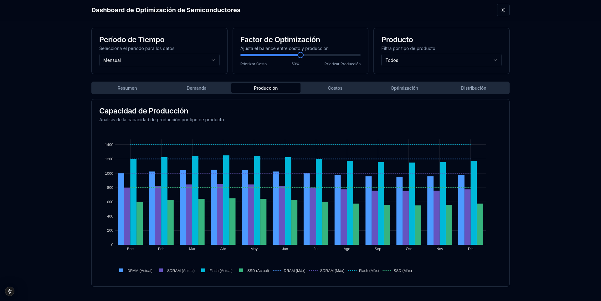

# 📊 Dashboard de Optimización de Producción con Programcion Lineal

## 📌 **Características Principales**

Este Dashboard de Optimización de Producción con Programcion Lineal interactivo, representa una solución avanzada para visualizar y optimizar la producción de semiconductores mediante técnicas de programación lineal. Diseñado con un enfoque elegante y minimalista, el proyecto ofrece insights y KPIs profundos para la toma de decisiones estratégicas en la industria de semiconductores.

El dashboard está construido con un diseño elegante y minimalista, y ofrece visualizaciones interactivas con **Plotly.js**.

---

## Características principales:

- **Visualizaciones interactivas con Plotly.js**: Gráficos interactivos que permiten explorar los datos en profundidad y analizar los diferentes aspectos de la producción.
- **Controles de filtrado y ajuste**: Herramientas que permiten seleccionar períodos de tiempo, productos y ajustar el factor de optimización.
- **Múltiples tipos de gráficos**:
  - Gráficos de líneas para pronósticos de demanda.
  - Gráficos de barras para visualizar la capacidad de producción.
  - Mapas de calor para la optimización de costos.
  - Gráficos de dispersión para comparar la producción versus la demanda.
  - Gráficos de pastel para la distribución de productos.
  - Superficies 3D para visualizar el espacio de optimización.
- **Organización por pestañas**: La interfaz está organizada de manera que facilita la navegación entre diferentes vistas y análisis.

---

## Modelo de programación lineal

El modelo de programación lineal implementado en **Python** utiliza la librería **SciPy** para optimizar la producción de semiconductores. El modelo toma en cuenta lo siguiente:
- Restricciones de recursos como silicio, mano de obra, energía, equipamiento y logística.
- Demanda máxima por producto.
- Costos de producción asociados a cada tipo de semiconductor.
- Beneficios por unidad producida.

El modelo encuentra la combinación óptima de producción que maximiza el beneficio total mientras respeta todas las restricciones.

---

## Cómo usar el dashboard

1. **Selector de Período de Tiempo**: Modifica la granularidad de los datos (semanal, mensual, trimestral o anual) según tus necesidades.
2. **Ajuste del Factor de Optimización**: Permite observar cómo diferentes estrategias de optimización afectan la producción y los costos.
3. **Selector de Producto**: Filtra los datos por tipo de semiconductor (DRAM, SDRAM, memoria Flash o SSD).
4. **Explora las diferentes pestañas**:
   - **Resumen**: Vista general con los gráficos más importantes.
   - **Demanda**: Análisis detallado de los pronósticos de demanda.
   - **Producción**: Visualización de la capacidad de producción.
   - **Costos**: Mapa de calor para la optimización de costos.
   - **Optimización**: Superficie 3D del espacio de solución.
   - **Distribución**: Muestra la distribución óptima de la producción por tipo de producto.

---

## Tecnologías utilizadas

- **React y Next.js**: Para la estructura y funcionalidad del frontend del dashboard.
- **Tailwind CSS**: Para el diseño y estilo visual.
- **shadcn/ui**: Para componentes de interfaz de usuario elegantes y modernos.
- **Plotly.js**: Para visualizaciones interactivas de gráficos.
- **Python con SciPy**: Para el modelo de programación lineal y optimización de producción (script incluido).

---

## Beneficios del dashboard

- **Visualización intuitiva**: Facilita la comprensión de datos complejos y su análisis visual.
- **Toma de decisiones informada**: Permite ver el impacto de diferentes estrategias de optimización de manera clara.
- **Optimización de recursos**: Ayuda a identificar la distribución óptima de recursos en la producción de semiconductores.
- **Planificación estratégica**: Facilita la comparación entre la demanda y la capacidad de producción, mejorando la toma de decisiones a largo plazo.

---

## Imagenes

---

## **Licencia**

Este proyecto está licenciado bajo la [Licencia GNU](LICENSE).

---
