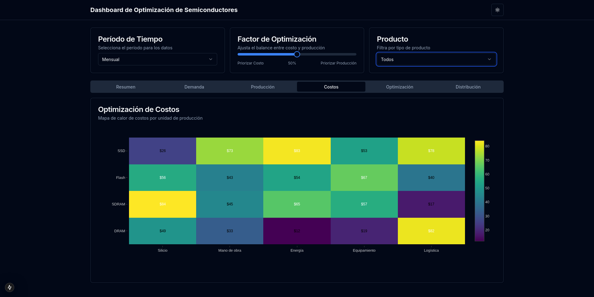
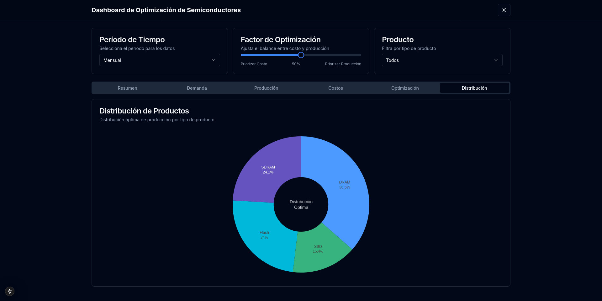

# Optimización de Producción con Programación Lineal

Esta proyecto forma parte de la propuesta para el **Genius Arena Hackathon 2025** de **Talent Land**, en el track **"Production Planning: Linear Programming and automation through Python"**, presentado por **Micron**. La propuesta consiste en:

> **System in Python that automates the necessary calculations to balance production with demand, allowing more precise and efficient planning and reducing costs, using linear programming modeling.**

## 📌 Características Principales

Este Dashboard interactivo representa una propuesta de solución avanzada para visualizar y optimizar la producción de semiconductores mediante técnicas de programación lineal con Python. Con un enfoque elegante y minimalista, el proyecto proporciona insights y KPIs profundos para la toma de decisiones estratégicas en la industria de semiconductores.

El Dashboard estaria desarrollado con Next.js y React con visualizaciones interactivas utilizando **Plotly**

---

## Funcionalidades Propuestas

- **Visualizaciones interactivas con Plotly**: Gráficos que permiten explorar y analizar en profundidad diversos aspectos de la producción.
- **Controles de filtrado y ajuste**: Herramientas para seleccionar períodos de tiempo, productos y ajustar factores de optimización.
- **Diversidad de gráficos**:
  - **Líneas**: Para pronósticos de demanda.
  - **Barras**: Para visualizar la capacidad de producción.
  - **Mapas de calor**: Para la optimización de costos.
  - **Dispersión**: Para comparar la producción versus la demanda.
  - **Pastel**: Para mostrar la distribución de productos.
  - **Superficies 3D**: Para visualizar el espacio de optimización.
- **Organización por pestañas**: Navegación intuitiva entre vistas y análisis.

---

## Modelo de Programación Lineal

El modelo de programación lineal, propuesto estaria desarrrollado en **Python**, utilizando las librerias **SciPy**, **PuLP**, y **Scikit-Learn** para optimizar la producción de semiconductores. Considerando:

- Bases de datos SQL, archivos CSV o JSON.
- Restricciones de recursos (silicio, mano de obra, energía, equipamiento y logística).
- Demanda máxima por producto.
- Costos de producción asociados a cada tipo de semiconductor.
- Beneficios por unidad producida.

El modelo busca la combinación óptima que maximice el beneficio total, respetando todas las restricciones.

---

## Cómo se Podria Utilizar el Dashboard

1. **Selector de Período de Tiempo**: Ajusta la granularidad de los datos (semanal, mensual, trimestral o anual).
2. **Ajuste del Factor de Optimización**: Evalúa cómo diferentes estrategias afectan la producción y los costos.
3. **Selector de Producto**: Filtra los datos por tipo de semiconductor (DRAM, SDRAM, memoria Flash o SSD).
4. **Navegación por Pestañas**:
   - **Resumen**: Vista general con gráficos clave.
   - **Demanda**: Análisis detallado de los pronósticos.
   - **Producción**: Visualización de la capacidad instalada.
   - **Costos**: Mapa de calor para la optimización de costos.
   - **Optimización**: Visualización en 3D del espacio de solución.
   - **Distribución**: Distribución óptima de la producción por producto.

---

## Propuesta de Tecnologías que se Utilizarían

- **React y Next.js**: Para la estructura y funcionalidad del frontend.
- **Tailwind CSS**: En el diseño y estilo visual.
- **shadcn/ui**: Para componentes de interfaz modernos.
- **Plotly.js**: En la creación de visualizaciones interactivas.
- **Python con SciPy, PuLP, y Scikit-Learn**: Para el desarrollo del modelo de programación lineal y la optimización de la producción.

---

## Beneficios del Dashboard

- **Visualización intuitiva**: Facilita la comprensión y análisis de datos complejos.
- **Decisiones informadas**: Muestra el impacto de diferentes estrategias de optimización de forma clara.
- **Optimización de recursos**: Identifica la mejor distribución de recursos en la producción.
- **Planificación estratégica**: Permite comparar la demanda con la capacidad productiva, mejorando la toma de decisiones a largo plazo.

---

## Galería de Imágenes

  
  
  
  
  

---
